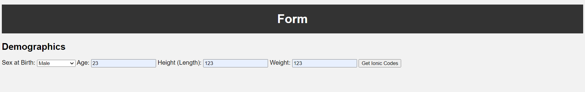
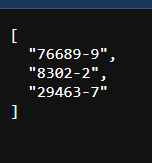

# Ionic Code Generator
This is a simple Flask application that generates a list of LOINC codes based on input from a form. The generated codes are used to query data from an EHR using the Ionic framework.

# Getting Started
* Clone this repository.
* Install Flask: pip install Flask.
* Run the application: python app.py.
* Navigate to http://localhost:5000 in your web browser.
# Usage
* Enter the patient's sex, age, height, and weight into the form.
* Click the "Generate Ionic Codes" button.
* The generated codes will be displayed in JSON format.
# Notes
1. The LOINC codes used in this application are hardcoded for demonstration purposes. In a real-world application, these codes would need to be obtained from a LOINC database.
2. This application uses the Flask web framework, which is not recommended for use in production environments. For production use, consider using a more robust web framework such as Django or FastAPI.

# Demo

